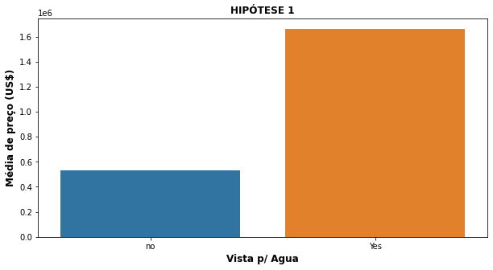
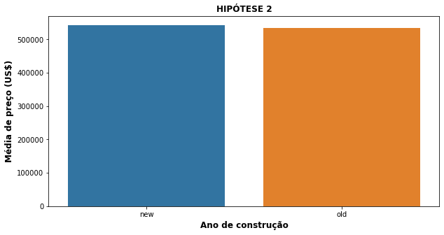
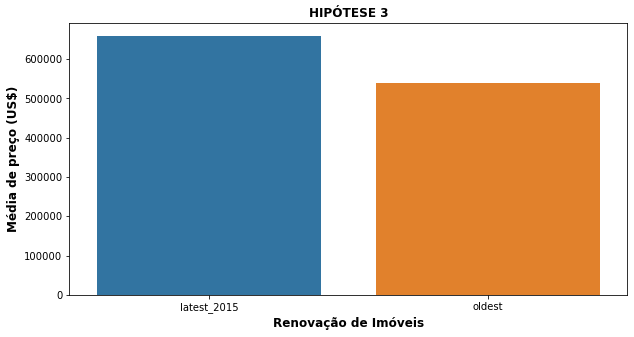
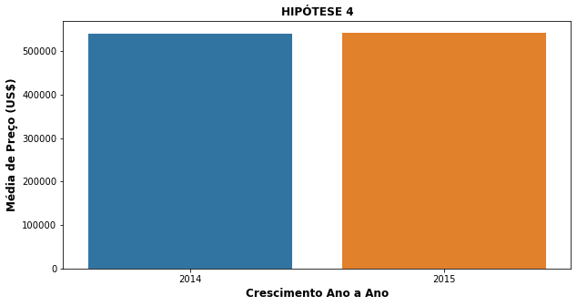
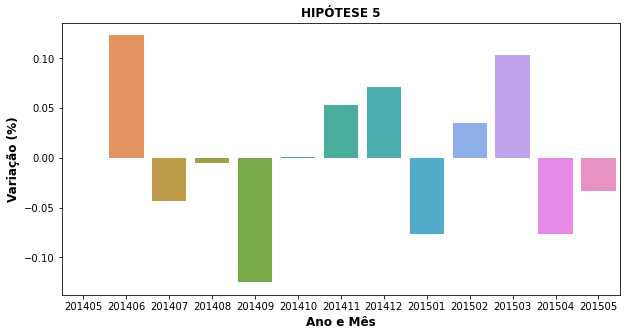

# House Rocket - Projeto de insights

Os dados usados neste projeto foram extraidos do [Kaggle](https://www.kaggle.com/harlfoxem/housesalesprediction), que se chama "House Sales in King County, USA".

## 1. Problema de Negócio

O problema de negócio desta empresa ficticia, se consiste em encontrar melhores oportunidades na compra e venda de imóveis, que estão dentro do portifólio da House Rocket, com o intuíto de maximizar o lucro da empresa encontrando bons negócios.

### 1.1 Objetivo

Gerar insights através da ánalise e exploração dos dados, para auxiliar na tomada de decisão pelo time de negócio.

### 1.2 Questões de negócio
- 1 - Quais são os imóveis a House Rocket deveria comprar e por qual preço?
- 2 - Qual é o mehor momento para a venda do imóvel e por qual preço?

### 1.3 Elementos a serem considerados
- Preços indicados em dólares americanos (US$).
- Dimensões de áreas indicadas em pés quadrados.
- Foram mantidos todos registros do conjunto de dados.
- Há “IDs” repetidos, porém com informações e atributos diferentes.
- Mantidos também os outliers para validação das hipóteses.

### 1.3 Hipóteses levantadas

Com o propósito de entregar mais valor para o time de negócio, iremos validar algumas hipóteses, sendo elas:

- HP1: Imóveis que possuem vista para água são pelo menos 30% mais caros, na média.
- HP2: Imóveis com ano de construção menor que 1955 são pelo menos 50% mais baratos, na média.
- HP3: Imóveis que foram renovados em 2015 são pelo menos 10% mais caros, na média.
- HP4: O crescimento do preço dos imóveis YoY (Year over Year) é de pelo menos 10%.
- HP5: Imóveis com 3 banheiros tem um crescimento de preço MoM (Month over Month) de pelo menos 15%.

### 1.4 Validação das hipóteses

- Os valores dos imóveis que possuem vista para a água são muito mais caros, representando 212,64% acima da média.

- O ano de construção não teve impactos significantes na alteração do preço.

- Imóveis que foram reformados recentemente, tendo ênfase em 2015, são em média 22.01% mais caros que os demais.

- O crescimento dos preços YoY (Ano após Ano) é de apenas 0.52%.

- Houve variação positiva e negativa entre os meses, mas nenhuma chegou ao pressuposto de 15%.

### 2.0 Planejamento da solução do problema de negócio
Para recomendação de compra:
- Agrupar os imóveis por região (zipcode).
- Dentro de cada região, detectar a mediana do preço do imóvel.
- É sugerido que os imóveis abaixo do preço mediano da região e que estejam em boas condições sejam comprados.

Para recomendação de venda:
- Agrupar os imóveis recomendados para compra por região (zipcode) e por sazonalidade (estações do ano).
- Dentro de cada região e sazonalidade, calcular a mediana do preço.
- É sugerido que as condições de venda sejam da seguinte forma:
    + Se o preço da compra for maior que a mediana da região + sazonalidade: O preço da venda será igual ao preço da compra + 10%.
    + Se o preço da compra for menor que a mediana da região + sazonalidade: O preço da venda será igual ao preço da compra + 30%.
    
### 3.0 Insights levantados
- Pouco mais da metade da base de dados, não são recomendados para a compra.

| Recomendação | Qtde. de Imóveis |
| :--- | :--- |
| Não Comprar | 11.034 |
| Comprar | 10.579 |

- Em média, as casas anunciadas no inverno são mais baratas do que na primavera, portanto, a sugestão é que as compras dos imóveis devam acontecer no inverno onde são mais baratas, e anunciadas para venda na primavera quando são mais caras

| Estação | Preço Médio Imóvel |
| :--- | :--- |
| Primavera | $397.242 |
| Verão | $390.080 |
| Outono | $379.273 |
| Inverno | $375.623 |

### 4.0 Resultados desta análise
- Considerando que a empresa efetue a compra de todos os imóveis recomendados, tendo como base o valor mediano, a empresa tem um potencial para economizar em torno de US$ 1.055.901.488,00 cerca de 25.79%.

- A empresa tem um potencial de lucro, considerando a compra de todos os imóveis recomendados, e os vendendo com o preço sugerido, um montante de US$ 774.596.310.60, cerca de 528.56%

### Autor
Rafael Cardoso

